# Loan Approval Classification Dataset

Analysis and classification model for loan approval prediction based on demographic information, credit scores, and collateral assets.

---

## Table of Contents

- [1. Overview](#1-overview)
- [2. Dataset](#2-dataset)
- [3. Analysis Pipeline](#3-analysis-pipeline)
- [4. Model Performance Comparison](#4-model-performance-comparison)
- [5. Feature Importance](#5-feature-importance)
- [6. Conclusion](#6-conclusion)
- [7. Setup & Usage](#7-setup--usage)

---

## 1. Overview

This project uses a dataset of **4,269 loan applications** with **12 input features** to predict loan approval status (`loan_status`: Approved / Rejected).

**Goal:** Build a high-accuracy classification model and identify the most influential factors in loan approval decisions.

**Best result:** Tuned Random Forest achieves **Accuracy 97.42%** and **ROC AUC 0.9984** on the test set.

---

## 2. Dataset

### 2.1. Summary

| Attribute | Value |
|-----------|-------|
| Records | 4,269 |
| Features | 12 (raw) → 17 (after feature engineering) |
| Target | `loan_status` (Approved / Rejected) |
| Target ratio | Approved: 62.2% — Rejected: 37.8% |

### 2.2. Variables Dictionary

| # | Variable | Type | Description |
|:---:|---|---|:---|
| 1 | `loan_id` | int | Unique loan identifier |
| 2 | `no_of_dependents` | int | Number of dependents |
| 3 | `education` | cat | Education level (Graduate / Not Graduate) |
| 4 | `self_employed` | cat | Self-employment status (Yes / No) |
| 5 | `income_annum` | int | Annual income |
| 6 | `loan_amount` | int | Loan amount requested |
| 7 | `loan_term` | int | Loan term (years) |
| 8 | `cibil_score` | int | CIBIL credit score (300-900) |
| 9 | `residential_assets_value` | int | Residential property value |
| 10 | `commercial_assets_value` | int | Commercial property value |
| 11 | `luxury_assets_value` | int | Luxury assets value |
| 12 | `bank_asset_value` | int | Bank assets / investments |
| **13** | **`loan_status`** | **cat** | **Approval status (Target)** |

### 2.3. Data Distribution

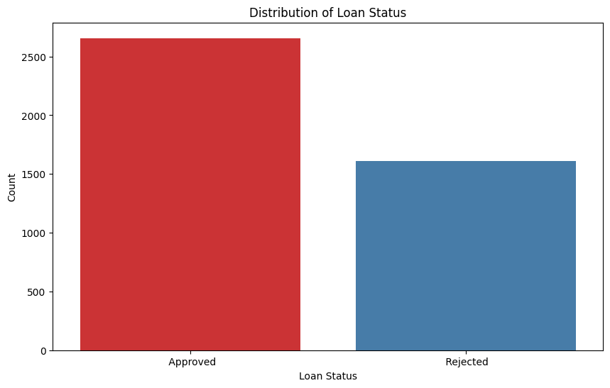
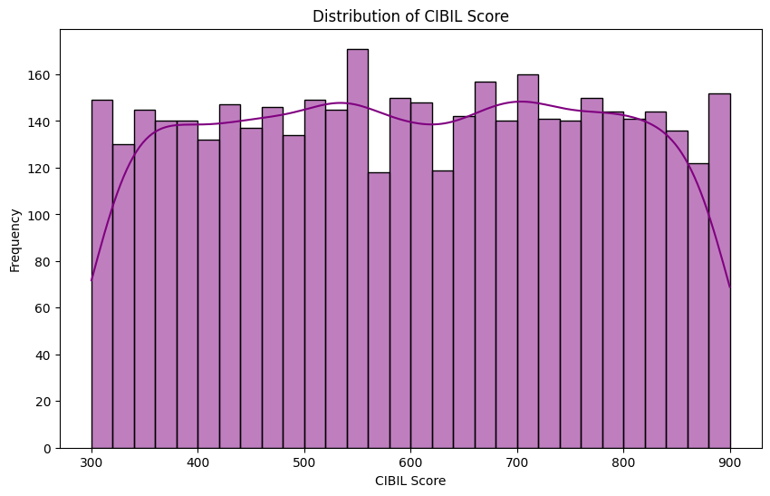
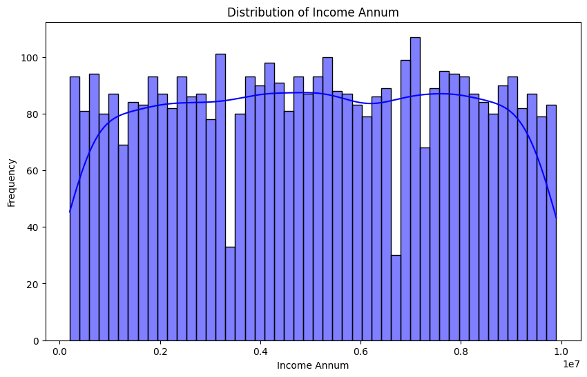
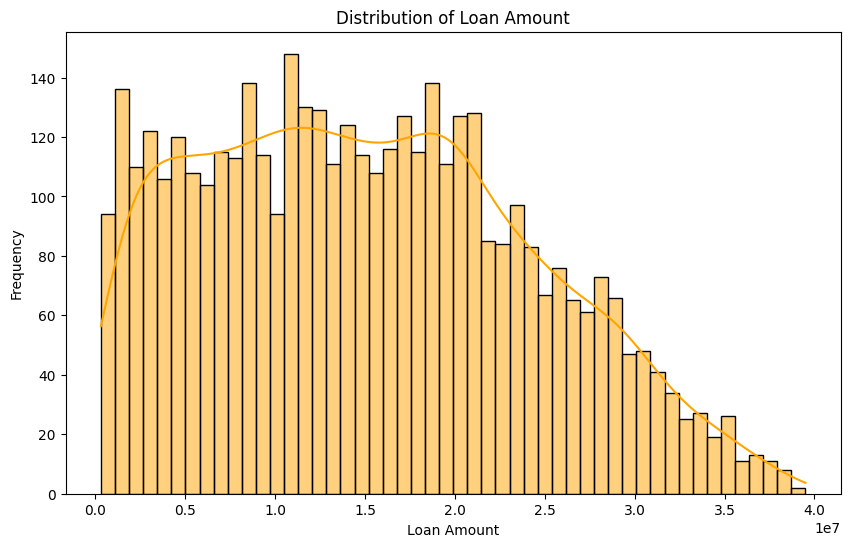
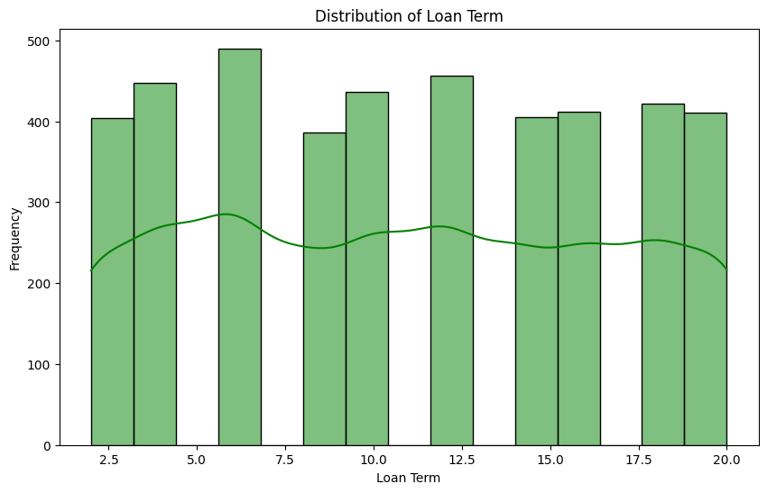
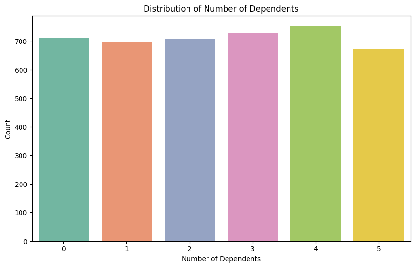
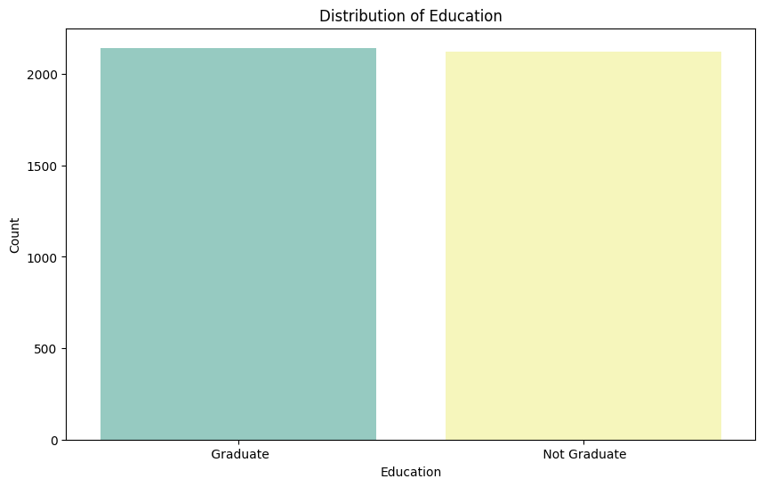
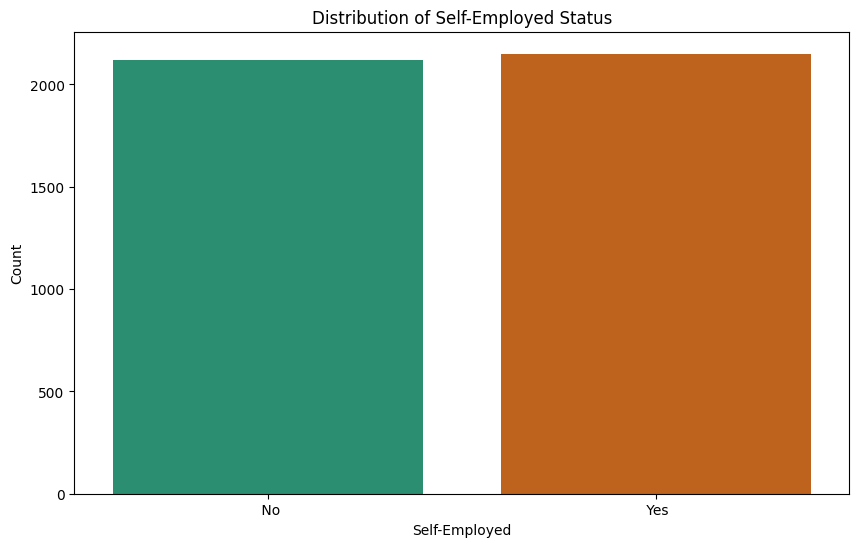
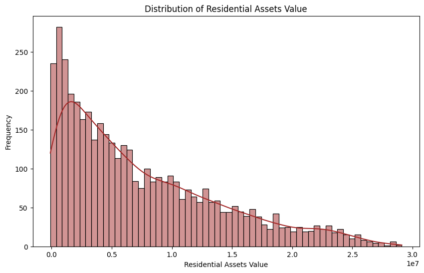
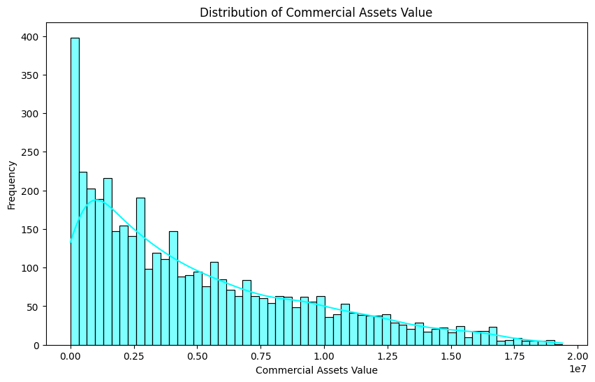
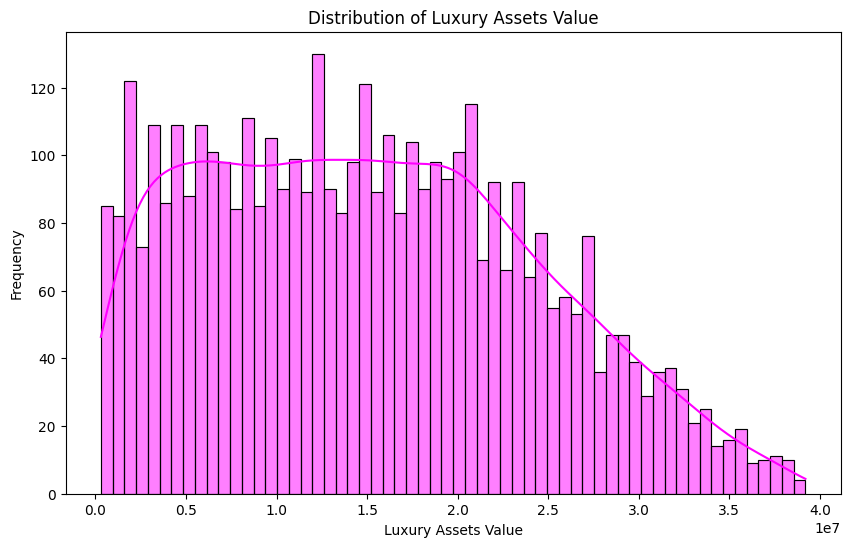
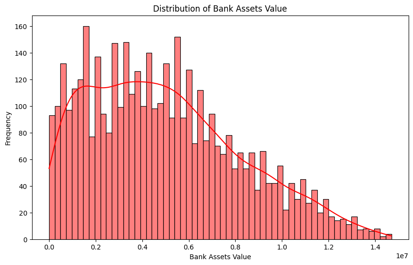

---

## 3. Analysis Pipeline

The project consists of **7 notebooks** in sequential order:

### Step 1: Information Data (`01_infomation_data.ipynb`)
- Load data, check structure, descriptive statistics
- Distribution analysis for each variable

### Step 2: EDA (`02_eda.ipynb`)
- Explore relationship between education and loan amount
- ANOVA / Kruskal-Wallis hypothesis testing

### Step 3: Feature Engineering (`03_feature_engineering.ipynb`)
- Create 5 new features:
  - `total_assets_value` — total asset value
  - `loan_to_income_ratio` — debt-to-income ratio
  - `assets_to_loan_ratio` — asset-to-loan ratio
  - `income_per_dependent` — income per dependent
  - `loan_per_term` — annual repayment pressure
- Label Encoding for categorical variables

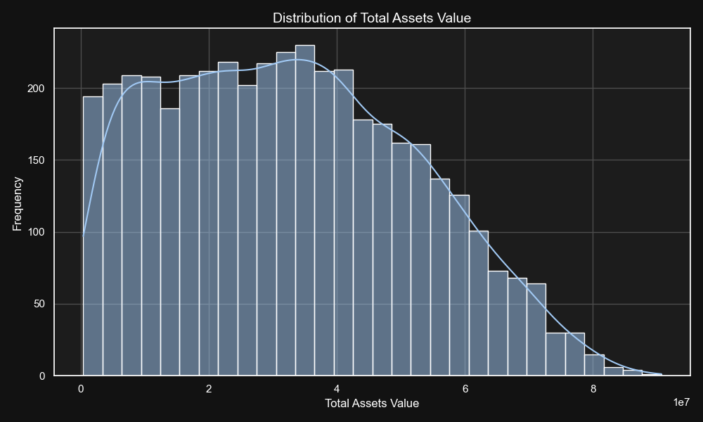

### Step 4: Train Models (`04_train_models.ipynb`)
- **Logistic Regression** (baseline)
- **Random Forest** baseline (overfitting detected)

### Step 5: Hyperparameter Tuning (`05_hyperparameter_tuning.ipynb`)
- Remove 5 features with potential data leakage
- GridSearchCV with 3-fold cross-validation
- Save best model

### Step 6: Pearson Correlation (`06_pearson.ipynb`)
- Correlation analysis: Income vs Loan Amount
- Correlation analysis: Total Assets vs Bank Asset

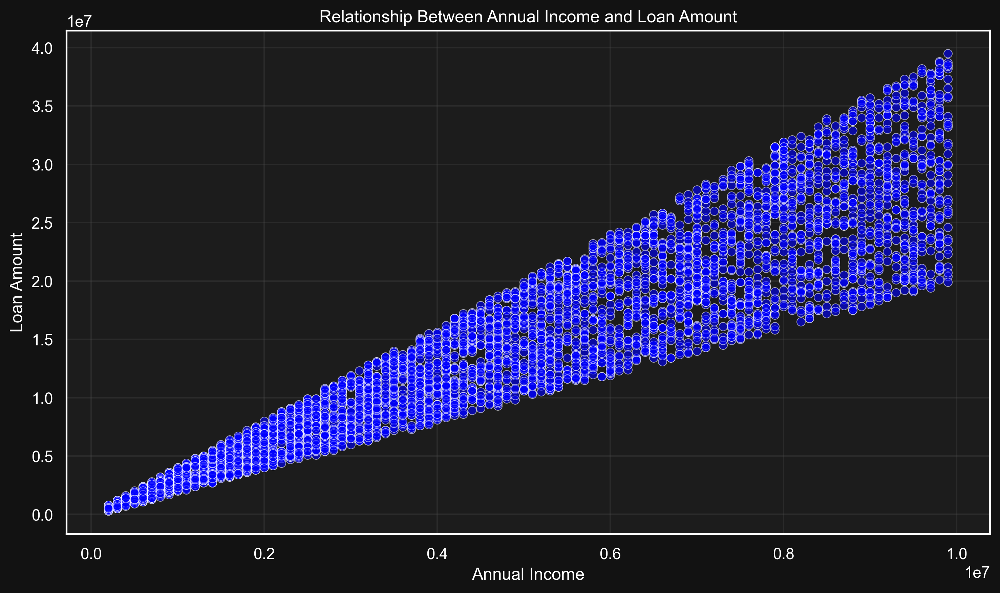
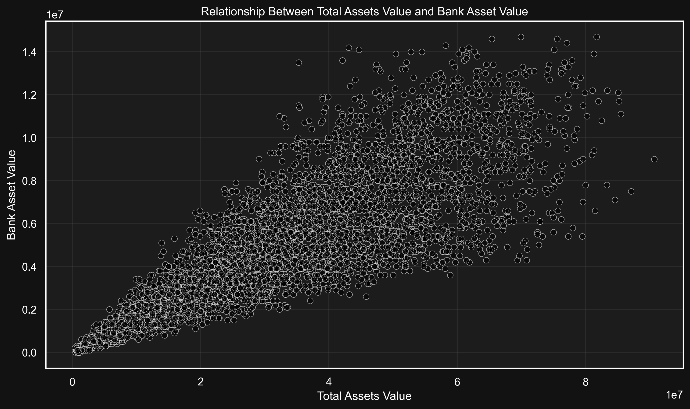

### Step 7: Chi-Square Test (`07_chi_square.ipynb`)
- Education vs Loan Status: p=0.772 → independent
- Self-Employed vs Loan Status: p=1.000 → independent

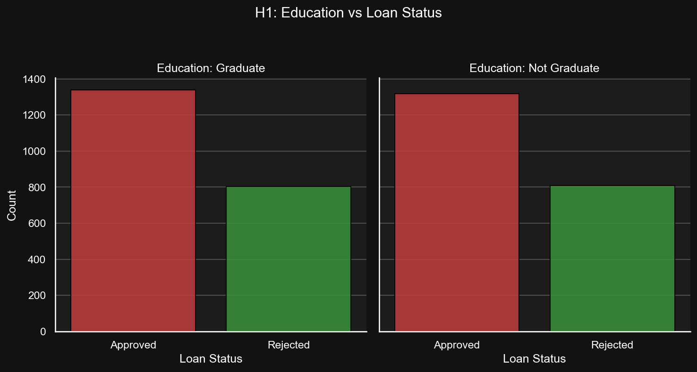
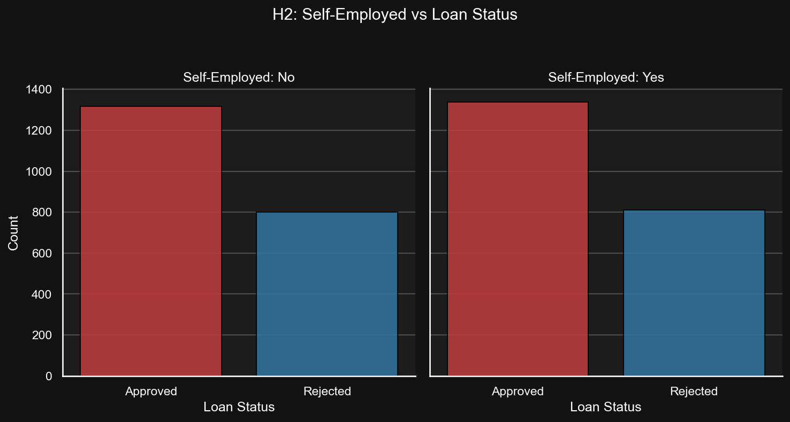

---

## 4. Model Performance Comparison

### 4.1. Model Overview

| Model | Accuracy | Precision | Recall | F1 Score | ROC AUC | Log Loss |
|-------|:--------:|:---------:|:------:|:--------:|:-------:|:--------:|
| **Logistic Regression** | 0.9251 | 0.9332 | 0.9473 | 0.9402 | 0.9789 | 0.1833 |
| **RF Baseline** | 0.9688 | 0.9961 | 0.9536 | 0.9744 | 0.9982 | 0.1314 |
| **RF Tuned (Best)** | **0.9742** | **0.9935** | **0.9649** | **0.9790** | **0.9984** | **0.0573** |

### 4.2. Model Details

#### Logistic Regression (Baseline)
- **Pros:** Simple, interpretable, no overfitting (train 92.80% / test 92.51%)
- **Cons:** Lowest accuracy among the three
- **CV mean accuracy:** 92.76% (5-fold)

#### Random Forest Baseline
- Params: `n_estimators=100, max_depth=6, min_samples_split=15, min_samples_leaf=8`
- **Train:** 96.39% — **Test:** 96.88%
- **CV mean accuracy:** 95.95% (5-fold)
- **Train/test gap:** -0.49% (good generalization)

#### Random Forest Tuned (Best Model) ⭐
- Optimal parameters from GridSearchCV:
  - `n_estimators=150, max_depth=6, max_features=0.6`
  - `min_samples_split=15, min_samples_leaf=8`
  - `class_weight='balanced'`
- **Train:** 97.32% — **Test:** 97.42%
- **CV mean accuracy:** 96.45% (5-fold)
- **Best CV score (GridSearch):** 96.75%
- **Train/test gap:** only -0.10%

### 4.3. Confusion Matrix — Best Model

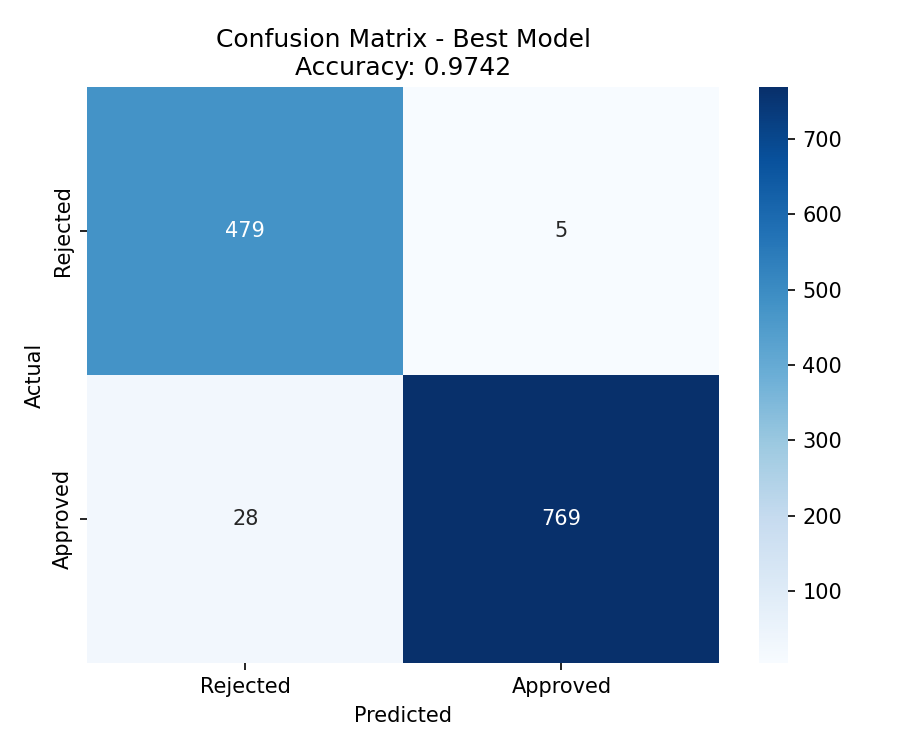

| | Predicted Rejected | Predicted Approved |
|---|---|---|
| **Actual Rejected** | 481 (TN) | 3 (FP) |
| **Actual Approved** | 30 (FN) | 767 (TP) |

- **Sensitivity (Recall for Approved):** 96.2%
- **Specificity (Recall for Rejected):** 99.4%

### 4.4. ROC Curve — Best Model

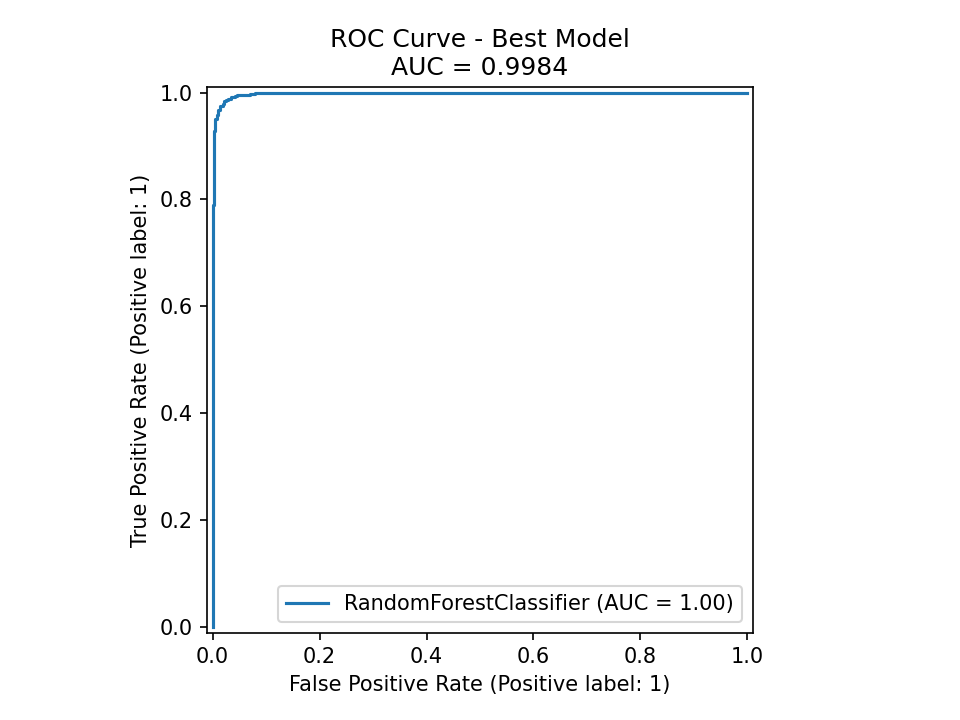

- **AUC = 0.9984** — near-perfect class separation.

---

## 5. Feature Importance

Feature importance from tuned Random Forest:

| Feature | Importance |
|---------|:----------:|
| **cibil_score** | **91.32%** |
| loan_term | 4.65% |
| loan_amount | 1.71% |
| income_annum | 0.73% |
| luxury_assets_value | 0.44% |
| commercial_assets_value | 0.38% |
| residential_assets_value | 0.34% |
| bank_asset_value | 0.25% |
| no_of_dependents | 0.11% |
| self_employed | 0.04% |
| education | ~0.00% |

> **Insight:** `cibil_score` accounts for **91%** of total importance — credit score is the single most decisive factor in loan approval. Demographic factors like education and self-employment status have negligible influence (consistent with Chi-Square test results).

---

## 6. Conclusion

1. **Best model:** Tuned Random Forest — Accuracy **97.42%**, ROC AUC **0.9984**
2. **Most important factor:** `cibil_score` (91.32% feature importance)
3. **Education & Self-Employed** have no statistical effect on loan_status (Chi-Square test)
4. **Overfitting resolved:** train/test gap reduced to 0.1% after tuning

---

## 7. Setup & Usage

### Requirements

- Python 3.8+
- Libraries listed in `requirements.txt`

### Installation

```bash
pip install -r requirements.txt
```

### Running notebooks

```bash
# Launch Jupyter
jupyter notebook

# Or use VS Code to open .ipynb files
```

Recommended notebook execution order:
1. `01_infomation_data.ipynb`
2. `02_eda.ipynb`
3. `03_feature_engineering.ipynb`
4. `04_train_models.ipynb`
5. `05_hyperparameter_tuning.ipynb`
6. `06_pearson.ipynb`
7. `07_chi_square.ipynb`

### Directory Structure

```
Loan_Approval_Classification_Dataset/
├── data/
│   ├── raw/              # Raw source data
│   ├── process/          # Cleaned data
│   └── external/         # External data
├── notebooks/            # 7 Jupyter notebooks
│   └── codebook.md       # Data dictionary
├── models/               # Trained models (.pkl)
├── reports/
│   ├── images/           # Analysis charts
│   │   ├── information_data/
│   │   ├── feature_engineering/
│   │   ├── pearson/
│   │   └── chi_square/
│   └── dashboard/        # Dashboard (Power BI)
├── documents/            # Reference documents
├── requirements.txt
├── README.md             # Vietnamese version
└── README.en.md          # English version
```
